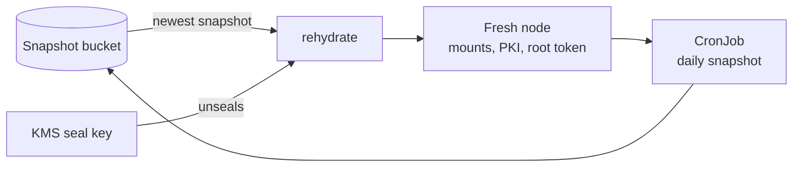

This platform is destroyed most nights to keep it affordable. OpenBao is the
store of record for secrets and the private PKI anyway — because what persists
between teardowns is not the instance.

![The whole design on one page. Top left, AWS as the active side: an EC2 OpenBao node auto-unsealed by the seal key, holding the PKI with its offline-signed intermediate and one jwt machine-auth mount per cluster. Top right, GCP as the standby: a GCE node deployed only on failover, which seals with the AWS key over federation and stores no AWS credential. Across the middle, the lineage that survives every teardown: the multi-region KMS seal key, under which alone a snapshot can be restored; the S3 snapshot bucket written daily and once more before every teardown; and the GCS mirror holding the same objects for the standby. Beneath them, five bootstrap secrets per cloud, each in that cloud's own secret store — nothing is synced between clouds, only the snapshot crosses. Along the bottom, the consumers, which authenticate by JWT with no stored credential: cert-manager for every internal TLS leaf, External Secrets materialising credentials into the cluster, and the openbao-snapshot job writing the daily object. Four numbered flows connect them: the seal key unsealing the node, the snapshot that is restored on the next deploy, the mirror to GCS, and the failover in which the standby restores from that mirror](/images/diagrams/openbao-architecture.svg)

## The idea in one line

**OpenBao's storage is derived state.** The node is disposable; the *lineage* is
not.

| Survives a teardown | Rebuilt on every deploy |
|---|---|
| The KMS **seal key** (multi-region) | The Raft store |
| **Five bootstrap secrets** per cloud | Every mount, policy, role and issuer |
| The **snapshot bucket**, and its cross-cloud mirror | The node itself |

## How a deploy puts it back

A fresh node is initialised with throwaway shares that are **never stored**, the
newest snapshot is restored into it, and the mounts, the PKI issuer and the root
token come back with it. There is no seeding step. If the bucket is empty — the
first deploy of a lineage — it is a plain init and the new keys are stored.

Before the cluster is destroyed, one last snapshot is taken, so nothing written
since the daily job is lost.

## Cross-cloud fallback

A snapshot can only be restored under **the seal that encrypted it**. So a GCP
standby unseals with the *AWS* KMS key, reached over OIDC federation — no AWS
credential is stored on the node.


This is why the seal is part of the snapshot's **filename**. A node refuses to
restore an object its own seal cannot unwrap, and refuses *before* the
irreversible step rather than after it.


## Machine authentication

No generated credential exists to store or rotate. Workloads present a
**projected ServiceAccount token**, which OpenBao validates against their
cluster's own OIDC issuer — one JWT mount per cluster.

## Where the detail lives


  
  
  
  

